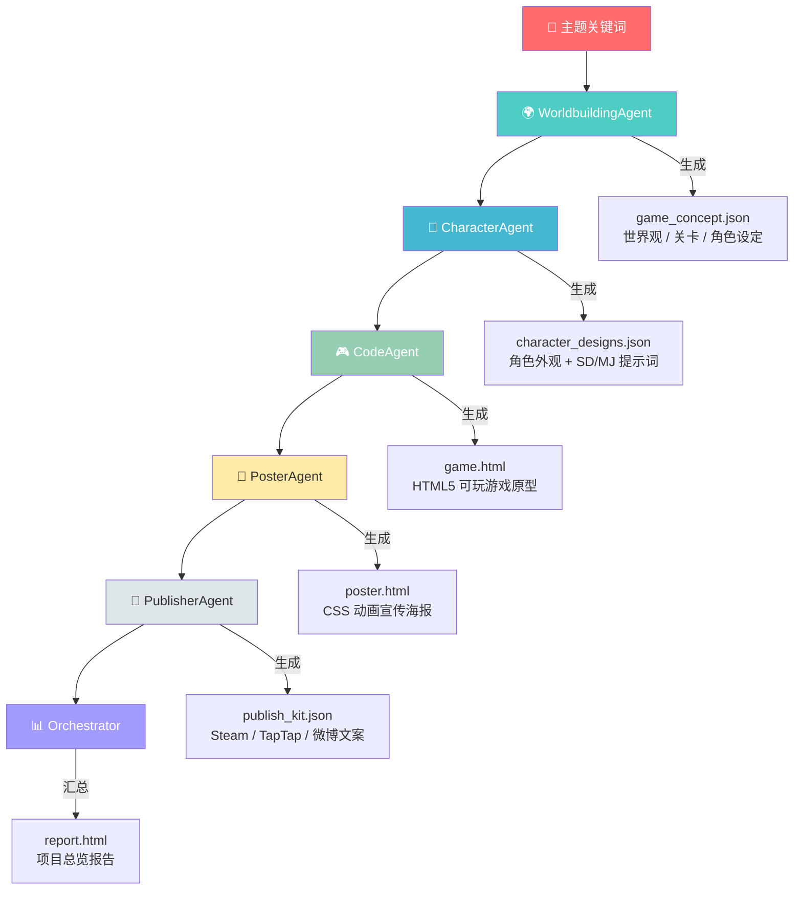

<p align="center">
  <h1 align="center">🎮 Game Art Pipeline</h1>
  <p align="center"><strong>多 Agent 游戏创作系统</strong> — 输入主题关键词，自动生成完整独立游戏项目包</p>
</p>

<p align="center">
  
  
  
  
  
</p>

---

## 📖 目录

- [架构概览](#-架构概览)
- [快速开始](#-快速开始)
- [输出文件说明](#-输出文件说明)
- [Agent 说明](#-agent-说明)
- [项目结构](#-项目结构)
- [扩展路线图](#-扩展路线图)
- [技术栈](#-技术栈)

---

## 🏗 架构概览



## 🚀 快速开始

### 前置要求

- **Python 3.10+**
- **Anthropic API Key** — [在此获取](https://console.anthropic.com/)

### 1. 安装

```bash
git clone https://github.com/Ice7en/game_art_pipeline.git
cd game_art_pipeline
pip install -r requirements.txt
```

### 2. 配置 API Key

```bash
export ANTHROPIC_API_KEY="your-api-key-here"
```

### 3A. 命令行模式

```bash
# 基础用法
python main.py --theme "赛博朋克 孤独 记忆"

# 指定输出目录
python main.py --theme "古风武侠 羁绊 复仇" --output my_game

# 断点续传 — 跳过已完成的步骤
python main.py --theme "海洋探索 神秘 生存" --skip code poster
```

| 参数 | 类型 | 必填 | 默认值 | 说明 |
|------|------|:--:|--------|------|
| `--theme` | `str` | ✅ | — | 游戏主题关键词，空格分隔 |
| `--output` | `str` | ❌ | `output` | 输出目录名称 |
| `--skip` | `list` | ❌ | `[]` | 跳过的步骤：`worldbuilding`, `character`, `code`, `poster`, `publisher` |

### 3B. Web UI 模式

```bash
cd web_ui
python app.py
# 打开浏览器访问 http://localhost:5000
```

---

## 📦 输出文件说明

| 文件 | 内容 | 使用方式 |
|------|------|----------|
| `game_concept.json` | 世界观、关卡设计、美术方向 | 供下游 Agent 读取 |
| `character_designs.json` | 角色外观 + SD/MJ 绘图提示词 | 导入 Stable Diffusion / Midjourney |
| `game.html` | HTML5 Canvas 可玩游戏原型 | 浏览器直接打开即可游玩 |
| `poster.html` | CSS 动画宣传海报 (1080×1920) | 浏览器打开，可截图导出 |
| `publish_kit.json` | Steam / TapTap / 微博 / 新闻稿 | 各平台发布时直接使用 |
| `report.html` | 完整项目总结报告 | 浏览器打开查看概览 |

---

## 🤖 Agent 说明

<details>
<summary><b>🌍 WorldbuildingAgent</b> — 世界观生成</summary>
<br>

- **输入**：主题关键词
- **输出**：`game_concept.json`
- **内容**：游戏标题、背景故事、主角/反派设定、关卡设计、美术风格、色彩方案
</details>

<details>
<summary><b>👤 CharacterAgent</b> — 角色设计</summary>
<br>

- **输入**：世界观 JSON
- **输出**：`character_designs.json`
- **内容**：3 个角色（主角 / 反派 / NPC）的详细外观设计 + Stable Diffusion / Midjourney 绘图提示词
</details>

<details>
<summary><b>🎮 CodeAgent</b> — 游戏原型生成</summary>
<br>

- **输入**：世界观 + 角色设定
- **输出**：`game.html`
- **内容**：单文件 HTML5 游戏，包含主菜单、游戏主体、结算界面、粒子特效
</details>

<details>
<summary><b>🎨 PosterAgent</b> — 宣传海报制作</summary>
<br>

- **输入**：世界观 + 角色设定
- **输出**：`poster.html`
- **内容**：1080×1920 竖版 CSS 动画海报，精美排版，视觉冲击力强
</details>

<details>
<summary><b>📝 PublisherAgent</b> — 发行文案撰写</summary>
<br>

- **输入**：世界观 + 角色设定 + 游戏原型
- **输出**：`publish_kit.json`
- **内容**：Steam 详情页（含系统需求）、TapTap 简介、新闻稿、Twitter / 微博 / Discord 文案
</details>

<details>
<summary><b>📊 Orchestrator</b> — 流程编排</summary>
<br>

- **输入**：所有上游产出
- **输出**：`report.html`
- **内容**：完整项目总结报告，流水线执行日志
</details>

---

## 📁 项目结构

```
game_art_pipeline/
├── main.py                  # CLI 入口
├── orchestrator.py          # 流程编排器
├── agents/                  # Agent 模块
├── web_ui/
│   └── app.py               # Flask Web 界面
├── requirements.txt         # Python 依赖
└── output/                  # 默认输出目录（运行后生成）
```

---

## 🗺 扩展路线图

- [ ] 接入 Stable Diffusion API 自动生成角色立绘
- [ ] 接入 Suno / Udio API 生成游戏配乐
- [ ] 接入 Unity WebGL 生成更完整的游戏原型
- [ ] 添加人工审核节点（Human-in-the-loop）
- [ ] 多语言版本 — 自动翻译英文发行文案
- [ ] Docker 一键部署

---

## 🛠 技术栈

| 层级 | 技术 | 用途 |
|------|------|------|
| AI 推理 | Anthropic Claude API (claude-opus-4-5) | 核心 Agent 智能 |
| 后端 | Python 3.10+ / Flask 3.0 | 服务与 Web UI |
| 游戏渲染 | HTML5 Canvas API | 可玩游戏原型 |
| 视觉特效 | 纯 CSS3 Animation | 宣传海报动画 |

---

<p align="center">
  <sub>Built with ❤️ using Anthropic Claude</sub>
</p>
